# intellij-guide
#### intellij常用的配置指南
工欲善其事，必先利其器。本文主要介绍intellij如何设置一些常用的功能，如何提升工具使用的便捷性，旨在提升大家使用intellij开发的效率。
本文intellij使用了2018.2.8版本

#### 硬件要求
因为idea会使用到缓存，索引文件，至少需要8G内存以上才会感觉不卡。

#### 常用设置
依次打开file -> Settings, 常用配置基本在这里。
- ###### Appearance & Behavior
  - Appearance需要设置的地方：
  
     1.主题修改，选择你喜欢的主题后需要重启才能生效，我喜欢黑色背景的所以选用了Darcula
     
     2.主题字体可修改，这里修改需要注意有些字体不支持中文会出现乱码，我一般选择Verdana size：12就可以了
     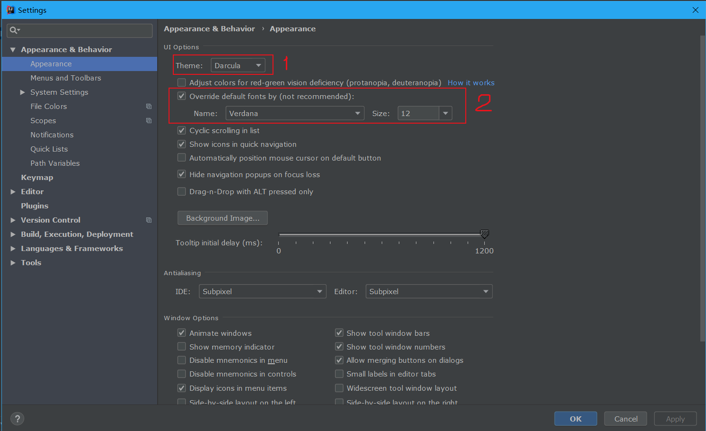
  - System settings
  
     1处Reopen last project on startup建议关闭
     
     2处建议选择Open project in new window 每次都使用新窗口打开
     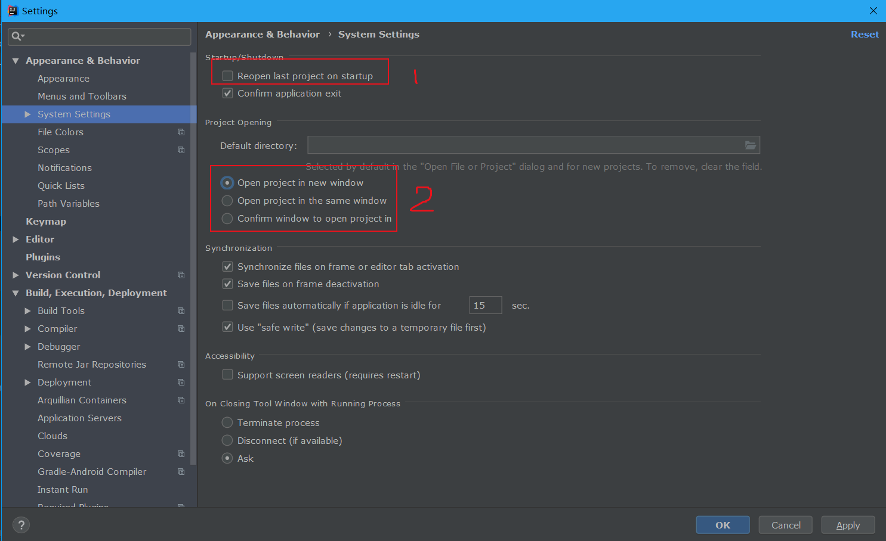
- ###### Keymap
  - 如果需要修改快捷键，双击快捷键弹出框选择
  
  比如代码提示快捷键Ctrl+空格经常被输入法占用，我们可以搜索Basic双击修改为Ctrl+逗号
  
  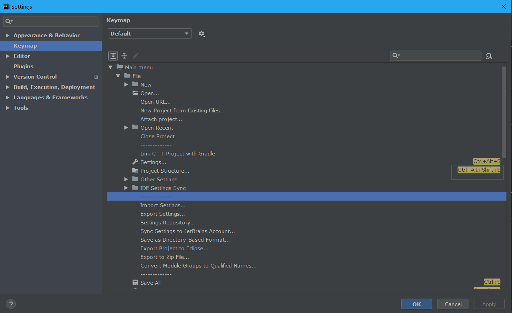
  
  - win系统下常用的快捷键
  
   |功能键|功能描述|
   |---|---|
   Ctrl + R|当前文本进行替换
   Ctrl + X|剪切光标所在行或所选择的内容
   Ctrl + D|复制光标所在行或复制选择内容，并插入光标所在的下行
   Ctrl + R|当前文本进行替换
   Ctrl + W|在原有选中基础上再扩展范围
   Ctrl + E|最近文件记录
   Ctrl + N|搜索类文件
   Ctrl + U|光标所在方法的父类的方法/接口定义地方
   Ctrl + B|进入光标所在的方法/变量的接口或是定义处
   Ctrl + O|可重写的方法
   Ctrl + I|可继承的方法
   Ctrl + F12|当前文件结构层
   Alt + F7|方法、变量、类被调用地方
   Alt + F8|Debug弹出计算表达式输入框，可查看输入内容的调试结果
   Alt + Insert|生成对象的get/set， toString等
   连续两次Shift|search everywhere
   Shift + F6|重命名
   Shift + Home|当前光标位置到行首都被选中
   Shift + End|当前光标位置到行尾都被选中
   Shift + Enter|开始新行
   Shift + F6|重命名
   Shift + 鼠标左键单击|关闭该文件
   Shift + 鼠标滚轮|文件横向移动
   Ctrl + Alt + 左方向键|退回上一个操作地方
   Ctrl + Alt + 右方向键|前进上一个操作地方
   Ctrl + Shift + F|整个项目或指定目录搜索
   Ctrl + Shift + R|整个项目或指定目录全部替换
   Ctrl + Shift + J|将下一行合并到当前行
   Ctrl + Shift + Z|取消撤销
   Ctrl + Shift + T|对当前类生成测试类
   Ctrl + Shift + C|复制当前文件的路径
   Ctrl + Shift + /|注释代码块
   Ctrl + Shift + Backspace|退回到上次修改地方
   Ctrl + Shift + 上方向键|光标放在方法上，该方法调整到前面
   Ctrl + Shift + 下方向键|光标放在方法上，该方法调整到后面
   Alt + Shift + 上方向键|光标所在行向上移动
   Alt + Shift + 下方向键|光标所在行向下移动
   F2|调到下一个高亮错误或警告位置
   F3|查找模式下，定位到下一个匹配处
   F7|Debug模式下，进入方法体内
   F8|Debug模式下，进入下一步
   F9|Debug模式下，恢复程序运行，或停留在下一个断点上
   
- ###### Editor
  - General-> Auto Import 
  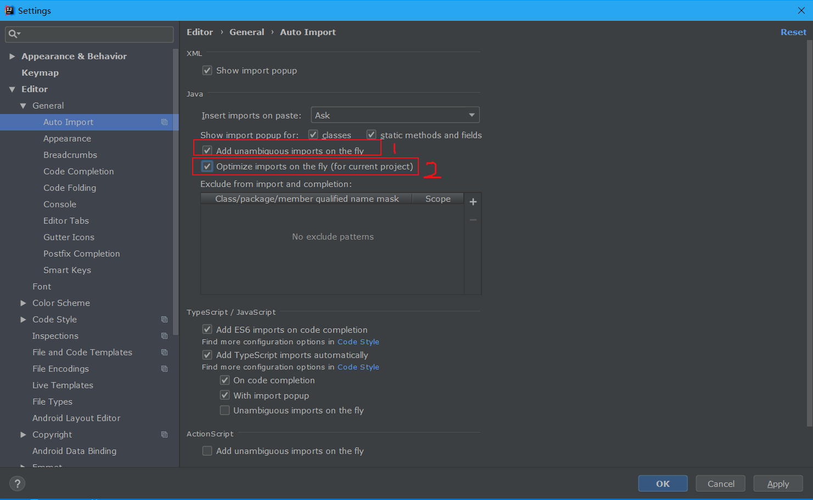
  
  1可以自动帮我们导入需要的包
  
  2可以帮助我们优化导入的包，自动去除一些不需要的import
  - General-> Appearance
  
    Show line numbers 显示行数
    
    Show method separators 显示方法线
  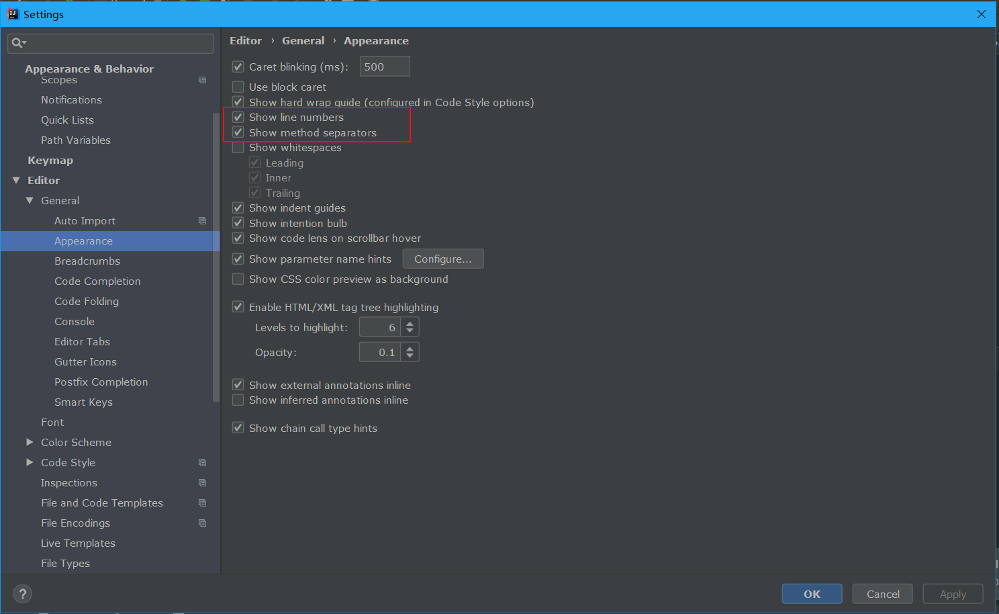
  - General-> Code Completion 代码提示和补充功能，All letter是不区分大小写的
  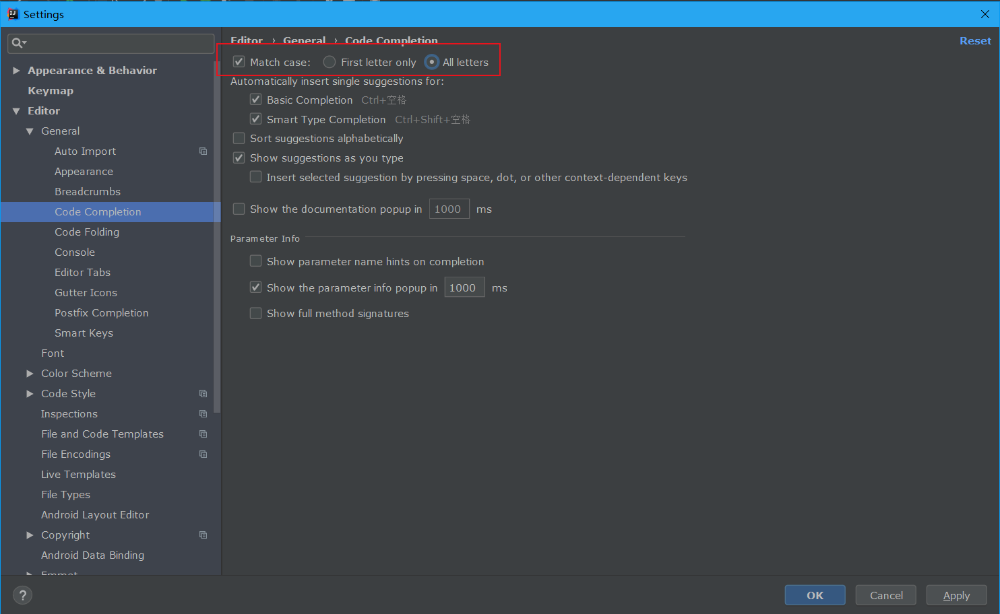
  - Font 这里修改的是代码的字体
  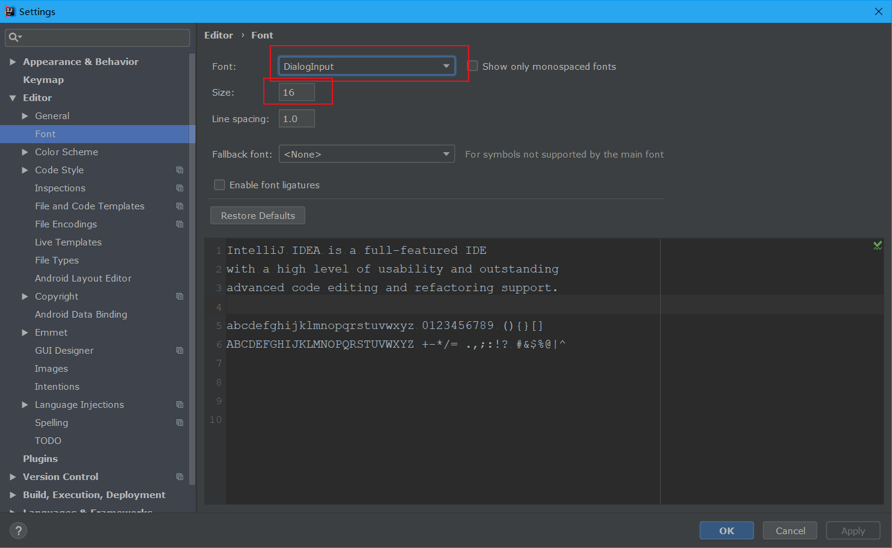
  - Color Scheme-> Console Font 这里修改的是控制台的字体
  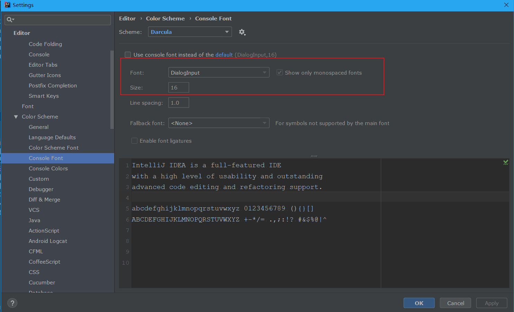
  
  - Inspection 
  
  搜索Serializable issues,勾选Serializable class without serialVersionUID，则可以帮我们生成serialVersionUID 
  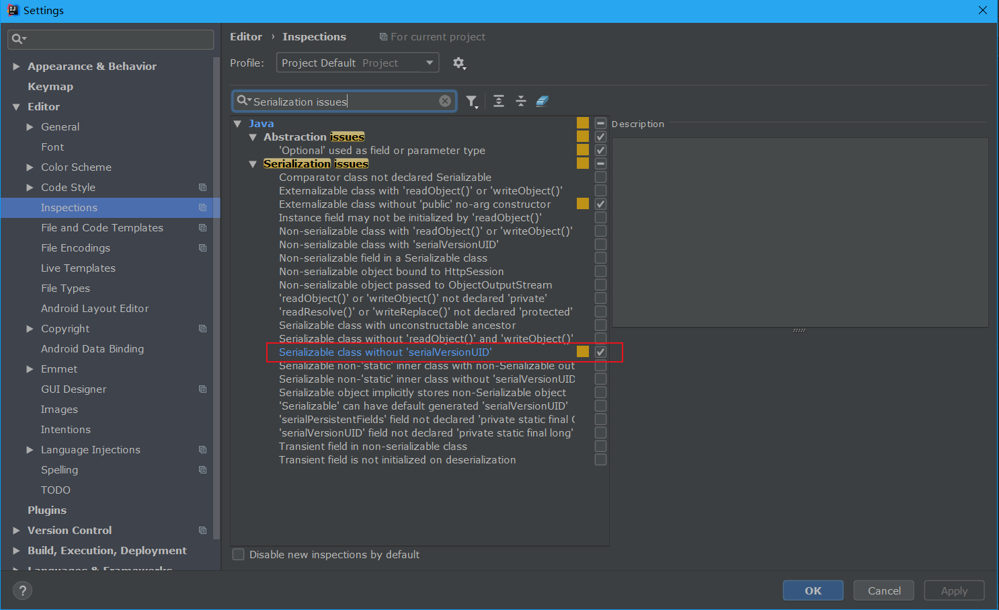
  
  - File Encodings 如图几处，建议都修改为UTF-8；
    Transparent native-to-ascii conversion也建议勾选上，主要用于properties文件的中文转换
  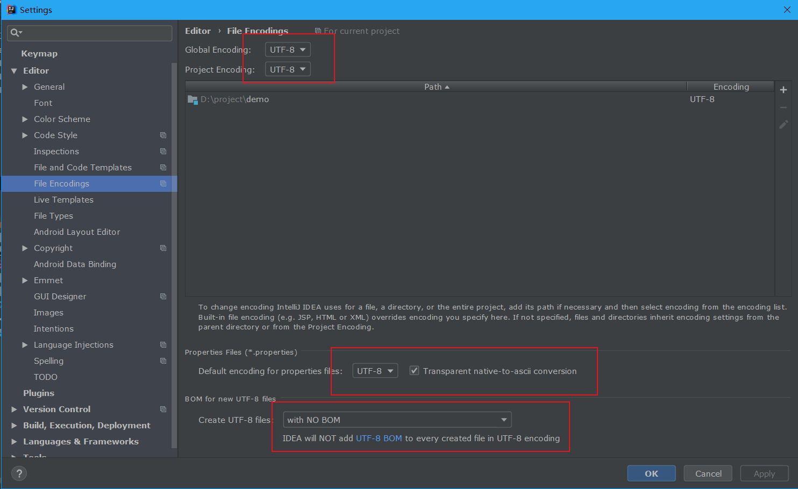
  
- ###### Build,Execution,Deployment
  - Compiler 如果编译过程很慢，可以加大内存，我的内存是16G，一般都设为1500
  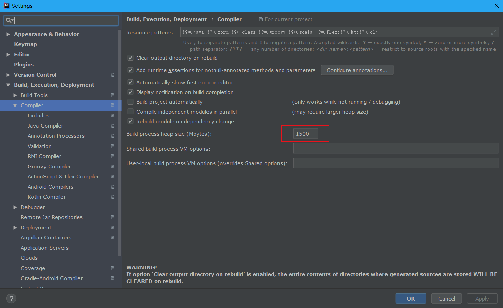  
#### 代码模板
##### 实时代码模板
##### 文件代码模板
##### 前端代码模板
##### 特殊模板

#### Debug使用

#### 常用版本管理工具
- ##### Maven
  
  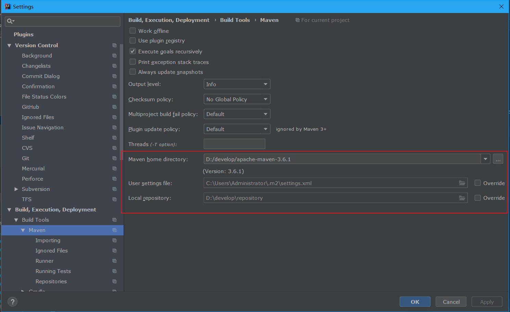  
  
  如果你没有配置MAVEN_HOME的环境变量，需要在maven home directory配置你的安装目录,还可以指定 Maven 的 settings.xml 位置和本地仓库位置
- ##### Git
##### 

#### 常用插件